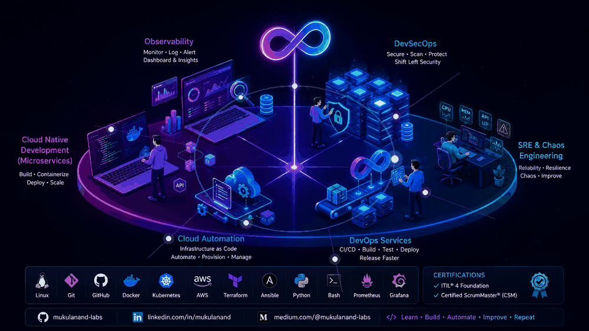
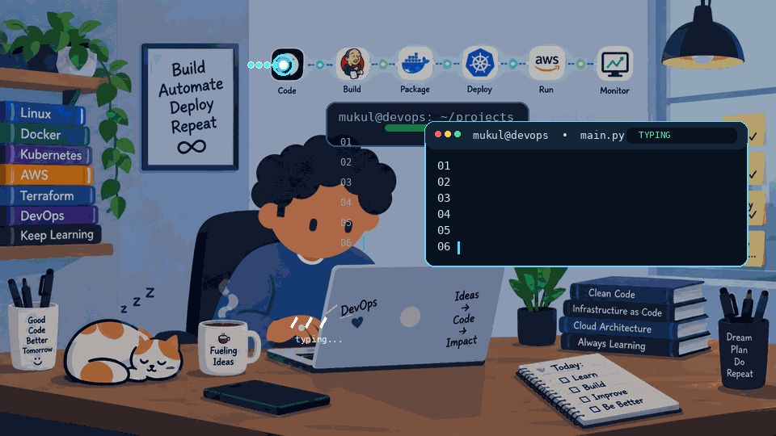

<!-- ===================== ANIMATED DEVOPS BANNER ===================== -->

<!--

<p align="center">
  
</p>

-->

<p align="center">
  
</p>


<h1 align="center">Hi 👋, I'm Mukul Anand from India 🇮🇳</h1>

<h3 align="center">
DevOps & Cloud Engineer | Automation | CI/CD | Cloud | SRE
</h3>

<!-- 
 
-->


<p align="right">
  
</p>


<p align="left">
  
</p>

---

## 👨‍💻 About Me

I am a DevOps & Cloud Engineer with a strong background in software development, production operations, service delivery, and IT service management. 
I focus on designing and automating **reliable, scalable, and secure infrastructure** and delivery processes, improving system availability, and enabling 
efficient software delivery across the application lifecycle.

- 💻 Software Development background
- 🚀 Service Delivery & Production Operations experience
- 🔧 Hands-on : Linux, Git, GitHub, Docker, Python and CI/CD
- ☁️ Building Cloud & AWS knowledge
- ☸️ Exploring Kubernetes and container orchestration
- 📊 Interested in SRE, observability, reliability and automation
- 📋 Practical experience with Incident, Problem and Change Management

---

## 🏅 Certifications

<p align="left">
  
  
</p>

---

## 🚀 What I Do

- 📈 Focus on SLA adherence, reliability and continuous improvement
- 🐧 Build Linux administration and troubleshooting skills
- 🔀 Practice Git/GitHub workflows, branching, merging and SSH
- 🐳 Build containerization skills with Docker
- ⚙️ CI/CD and deployment automation
- ☁️ Build practical Cloud/AWS knowledge
- ☸️ Progress toward Kubernetes and SRE
- 🎯 Drive application/service delivery and production operations
- 🚨 Coordinate critical incidents and restoration activities
- 🔍 Perform Root Cause Analysis and drive corrective actions
- 📋 Work with Incident, Problem and Change Management processes
- 🤝 Coordinate across engineering, support and stakeholder teams

---

## 🧰 DevOps Toolchain

### ☁️ Cloud & Infrastructure

<p align="left">
  
</p>

### 🐳 Containers & Orchestration

<p align="left">
  
</p>

### 🔁 CI/CD & Automation

<p align="left">
  
</p>

### 📊 Observability & Monitoring

<p align="left">
  
</p>

### 🗄️ Version Control & Development

<p align="left">
  
</p>

### 🖥️ Operating Systems

<p align="left">
  
</p>

---

## 🔄 My DevOps / SRE Journey

```text
Software Development
        │
        ▼
Service Delivery & Production Operations
        │
        ▼
      Linux
        │
        ▼
   Git & GitHub
        │
        ▼
     Docker
        │
        ▼
     CI / CD
        │
        ▼
      Cloud
        │
        ▼
   Kubernetes
        │
        ▼
Observability & Monitoring
        │
        ▼
       SRE
        │
        ▼
Platform Engineering
```

### 🧠 My Learning Philosophy

<p align="center">
  <b>💡 Learn</b>
  &nbsp;→&nbsp;
  <b>🛠️ Build</b>
  &nbsp;→&nbsp;
  <b>💥 Break</b>
  &nbsp;→&nbsp;
  <b>🧩 Fix</b>
  &nbsp;→&nbsp;
  <b>⚙️ Automate</b>
  &nbsp;→&nbsp;
  <b>📝 Document</b>
</p>

<p align="center">
  <i>“Don't just learn how it works — build it, break it, fix it, automate it, and share what you learned.”</i>
</p>

---

## 🔨 Hands-On Projects

🚧 **This section will grow as I build and publish projects.**

### 🐧 Linux Labs
Practical Linux administration and troubleshooting exercises.

### 🔀 Git & GitHub Labs
Hands-on work with repositories, branches, merges, conflicts, SSH and remote workflows.

### 🐳 Docker Labs
Containerization exercises covering images, containers, Dockerfiles, volumes and networking.

### ⚙️ CI/CD Labs
Building automated pipelines with GitHub Actions and Docker.

### ☁️ Cloud Labs
Practical AWS infrastructure and automation experiments.

### ☸️ Kubernetes Labs
Progressively building Kubernetes deployments, services and troubleshooting skills.

---

## ✍️ Technical Writing

I believe documenting what I learn is an important part of becoming a better engineer.

I plan to write about:

- Linux troubleshooting
- Git & GitHub
- Docker
- CI/CD
- Python automation
- Cloud
- Kubernetes
- SRE
- Production troubleshooting
- Lessons learned while transitioning toward DevOps

> **Learning something is good. Building it, breaking it, fixing it and documenting it is better.**

---


## 📊 GitHub Activity

<p align="center">
  
</p>

<p align="center">
  
</p>

<p align="center">
  
</p>

---

## 📌 Featured Projects

As I build projects, I'll pin the strongest ones here and on my profile.

- 🐧 Linux Administration Labs
- 🔀 Git & GitHub Labs
- 🐳 Docker Projects
- ⚙️ CI/CD Pipeline Projects
- 🐍 Python Automation
- ☁️ AWS Infrastructure
- ☸️ Kubernetes Projects
- 📊 Monitoring & Observability

---

## 🤝 Let's Connect

<p align="left">
  <a href="https://github.com/mukulanand-labs">
    
  </a>
  <a href="https://www.linkedin.com/">
    
  </a>
  <a href="https://medium.com/">
    
  </a>
</p>

---

## ⚡ Fun Fact

> I enjoy solving real production problems — and I'm now learning how to
> **automate those solutions instead of solving the same problem twice.** 😄

---

<h3 align="center">

<p align="center">
  <b>💡 Learn</b>
  &nbsp;→&nbsp;
  <b>🛠️ Build</b>
  &nbsp;→&nbsp;
  <b>💥 Break</b>
  &nbsp;→&nbsp;
  <b>🧩 Fix</b>
  &nbsp;→&nbsp;
  <b>⚙️ Automate</b>
  &nbsp;→&nbsp;
  <b>📝 Document</b>
</p>

</h3>
